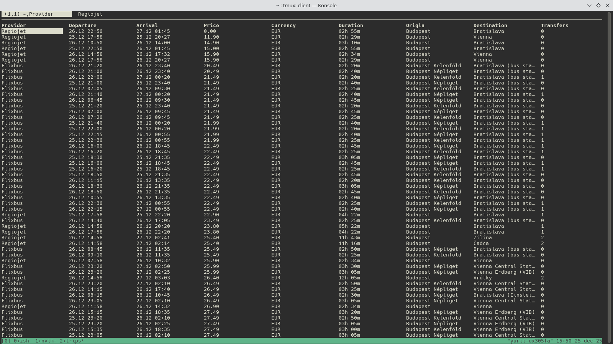

# Trips CLI 🚍🚆


[](https://opensource.org/licenses/MIT)

**trips** is a fast, concurrent command-line tool that aggregates bus and train schedules from major European providers (**Flixbus**, **Regiojet**).

It allows you to search for trips between cities, entire countries, or find destinations within a specific radius of your location.



## Features

*   **Multi-Provider Support:** Search Flixbus and Regiojet simultaneously.
*   **Smart Location Search:**
    *   **City:** `Prague`, `Berlin`
    *   **Country:** `Germany`, `Austria` (searches all stations in the country)
    *   **Distance:** Find all destinations within `X` km of an origin.
*   **Date Parsing:** Supports natural language like `today`, `tomorrow`, or specific dates (`24.12`).
*   **Concurrency:** Fetches results in parallel for maximum speed.
*   **Export & View:** Automatically saves results to CSV and opens them in `tabview` if installed.

## Installation

### Prerequisites

*   **Go 1.23+**
*   **[tabview](https://github.com/TabViewer/tabview)** (Optional, but highly recommended for viewing results)

### Install with Go

```bash
go install github.com/yuriiter/trips
```

## Usage

### Basic Search

Search for trips between two cities for tomorrow:

```bash
trips --from "Budapest" --to "Vienna" --date "tomorrow"
```

Search for trips to multiple desinations for multiple dates:

```bash
trips --from Budapest --to Vienna,Berlin --date today,tomorrow
```

### Country-Wide Search

Search from a specific city to anywhere in a country:

```bash
trips --from "Prague" --to "Germany" --date "2025-12-28"
```

### Radius Search (Explore)

Find all reachable destinations within 300km of Brno:

```bash
trips --from "Brno" --distance 300 --date "next friday"
```

### Filter by Provider

Limit search to a specific provider:

```bash
trips -f "Paris" -t "London" -p flixbus
```

## Flags

| Flag | Shorthand | Description |
|------|-----------|-------------|
| `--from` | `-f` | Origin city or country (**Required**) |
| `--to` | `-t` | Destination city or country |
| `--date` | `-d` | Date (today, tomorrow, YYYY-MM-DD) |
| `--distance` | `-D` | Search destinations within X km of origin |
| `--provider` | `-p` | Provider (`all`, `flixbus`, `regiojet`) |
| `--sort` | `-s` | Sort results by: `price` (default), `departure` |
| `--out` | `-o` | Custom output CSV file path |
| `--debug` | `-v` | Enable debug logs |

## Output

Results are displayed in the console and automatically saved to `~/trips/` in CSV format. If `tabview` is installed, it will launch automatically with the results.

## License

MIT
